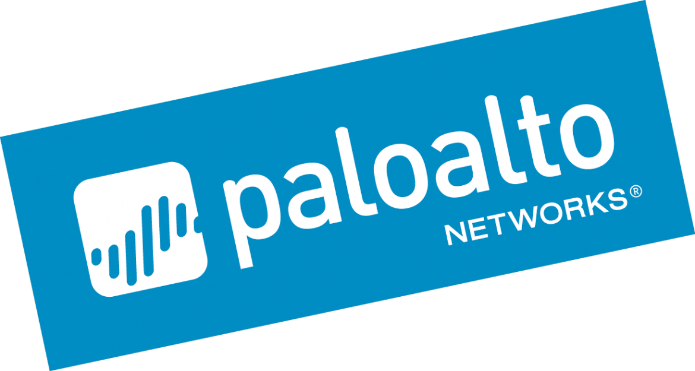

.. AWS documentation master file, created by
   sphinx-quickstart on wed nov 20 17:08:44 2019.
   You can adapt this file completely to your liking, but it should at least
   contain the root `toctree` directive.

AWS Automation Lab Guide
=========================================

Welcome
-------

Welcome to the AWS Security Automation Lab!

In this lab we will be learning how to automate the deployment and configuration of infrastructure supporting a web application within AWS public cloud provider.  A key element of this infrastructure is the Palo Alto Networks NGFW.  

Following the deployment, we will automate the configuration of the firewall to support and protect protect the web application through a VPC Transit  

Lastly, we will ensure that the firewall is able to respond effectively to changes made to the application infrastructure.  You will deploying your application in Amazon Web Services (AWS).  

Objective
---------
The objective of this workshop is to deploy and secure a `WordPress <https://wordpress.org>`_ content management system in AWS.  This web application will be supported by an `Apache <https://httpd.apache.org>`_ web server and a database server residing in two separate subnets with different AZ.  

As part of our infrastructure deployment, a VM-Series NGFW in a specific VPC 'VPC-Transit' will be inserted between Internet and the web subnet, and the database subnet.  However, we will need to configure this virtual firewall to support its network environment and the applications it will be protecting.

Learning Outcomes
----------
- Understand the various methods for automating the deployment of Palo Alto Networks NGFW instances in cloud environments
- Learn to use industry-leading configuration management automation tools to implement changes to PAN-OS devices
- Learn how the Palo Alto Networks NGFW can automatically respond to changes in the network environment

.. toctree::
   :maxdepth: 2
   :hidden:
   :caption: overview

   00-overview/introduction

.. toctree::
    :maxdepth: 2
    :hidden:
    :caption: getting started

    01-getting-started/requirements
    01-getting-started/setup

.. toctree::
    :maxdepth: 2
    :hidden:
    :caption: cloud discovery

    02-cloud-discovery/aws/step-by-step

.. toctree::
    :maxdepth: 2
    :hidden:
    :caption: build

    03-build/deploy-aws

.. toctree::
    :maxdepth: 2
    :hidden:
    :caption: run

    04-run/1-terraform/terraform
    04-run/2-ansible/ansible
    04-run/3-validation/validation

.. toctree::
    :maxdepth: 2
    :hidden:
    :caption: respond

    05-respond/1-monitor/monitor
    05-respond/2-dag/dag
    05-respond/3-scale/scale
    
.. toctree::
    :maxdepth: 2
    :hidden:
    :caption: prisma cloud

    06-prisma-cloud/prisma-cloud

.. toctree::
    :maxdepth: 2
    :hidden:
    :caption: summary

    07-summary/summary
    07-summary/comparison
    07-summary/cleanup
    07-summary/moreinfo

.. toctree::
    :maxdepth: 2
    :hidden:
    :caption: appendix

    08-appendix/terraform-commit
    04-run/1-terraform/background-terraform
    04-run/2-ansible/background-ansible
